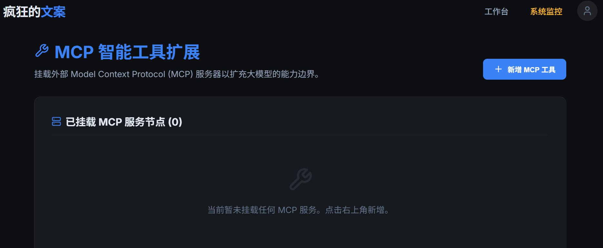
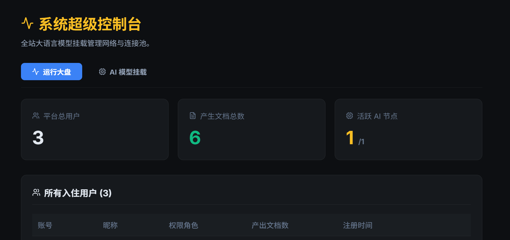

# 疯狂的文案 (AI Copywriter) ✍️✨

> **智能文案平台** — 融合 Agentic AI 与现代化编辑工作流的全新体验。由 React 强劲驱动，结合 Express 后端与 Prisma ORM 构建。


## 🌟 核心特性 (Features)

**疯狂的文案** 不仅仅是一个 AI 对话UI，而是一个提供**细粒度操纵与全局思维链可见度**的终极 Agentic 工作台：

- 🧠 **Thinking Mode 可视化引擎**：智能拆解大语言模型的 `<think>` 标签输出。工作流清晰分离“思考步骤”和“执行结果”，杜绝“AI 黑盒”。
- 🎯 **上下文精准锁定 (Selection-Lock)**：在 Markdown 编辑器中进行段落框选后，自动在后台截获锚点边界注入 AI 视野，实现“指哪打哪”的外科手术式重写。并配有优雅的“确认采纳 / 撤销还原”悬浮预览。
- 🔧 **MCP (Model Context Protocol) 插件聚合**：原生集成开放的 MCP 服务节点挂载机制，大平台能力随心扩展！在后台直接填入命令与参数，平台即插即用（如 Github 代码检索、数据库查询、本地文件操作等自动化工具）。
- 🔥 **智能大盘 ＆ 多模版管理**：
    - 全局网络模型节点：系统管理员可全权掌控、动态增删第三方 LLM API（支持 OpenAI、Qwen-Turbo 等）。
    - 运行态监测表：高颜值的 Admin 管理后台展现包括文档生成数、系统活跃模型池率及全态的注册用户清单。
- 🎨 **Glassmorphism 美学 & 个性化引擎**：深度打磨的全局双边视图拖拽交互，采用极简的毛玻璃渐层审美；同时支持**深邃黑夜**与**石英日间**两套精密算法驱动的主题配置。

---

## 📸 界面展示 (Screenshots)

在这里你可以直观地感受到经过像素级打磨的平台质感：

|<div align="center">🔮 Agentic 工作流平台主页</div>|<div align="center">💻 Thinking 思维链执行流</div>|
|:---:|:---:|
||

|<div align="center">🔧 MCP 全局工具池</div>|<div align="center">📈 控制台与实时大盘</div>|
|:---:|:---:|
|||


---

## 🛠️ 技术栈 (Tech Stack)

### 前端 (Client)
- **核心框架**：React + Vite + TypeScript
- **UI 呈现**：纯 CSS / CSS Variables 实现自适应日夜流体切换
- **编辑器组件**：`@uiw/react-md-editor` (支持实时 HTML 代码标注预览)
- **图标**：`lucide-react` 图标集

### 后端 (Server)
- **核心框架**：Node.js + Express
- **数据库 ORM**：Prisma Client
- **数据库层**：SQLite (`dev.db` 嵌入式存储)
- **流式响应引擎**：SSE (Server-Sent Events) 打通前端交互流

---

## 🚀 快速启动指南 (Getting Started)

本项目采用 `concurrently` 进行 Monorepo 级联式极速启动，一行指令纵向挂载前端客户端与后端接口层。

### 1. 环境准备
请确保您已经安装了 Node.js (推荐 v18+)。

### 2. 初始化安装与数据库同步
在项目根目录 (`c:\Users\zhao6\Documents\code\writer`) 执行以下命令：

```bash
# 一下安装主目录及前、后端依赖包
npm run install:all

# 将 Prisma Schema 定义推送至本地 SQLite 数据库中构建基础表
npm run db:push
```

### 3. 运行开发服务器

```bash
npm run dev
```

该指令将会同时唤起：
- **后端 API 服务**：通常默认位于端口 `3000` 左右。
- **前端 Vite 客户端**：访问热更新地址进行开发体验。

> 💡 **Tip:** 前往 `Settings` 界面可调节视觉模式，前往右上角 `系统超级控制台 (Admin)` 能够预定义所需的系统运行配置及模型池加载。

---

## ⚙️ 目录结构 (Folder Structure)

```text
writer/
│
├── package.json          # Root 主命令层 (启动 scripts)
├── README.md             # 本文档
│
├── src/                  
│   ├── client/           # 🔮 React 前端代码层
│   │   ├── src/          # 核心业务组件与 Pages
│   │   └── package.json  # Vite 依赖定义
│   │
│   └── server/           # 💻 Express 后端代码层
│       ├── prisma/       # ORM 定义 (schema.prisma) & dev.db 数据持久化
│       ├── src/          # API Controllers 业务组
│       └── package.json  # Node.js 依赖层
```

---

## 👋 联系与交流 (Contact)
欢迎沟通与探讨！
公众号/全网同名：**今天搬了什么砖**
